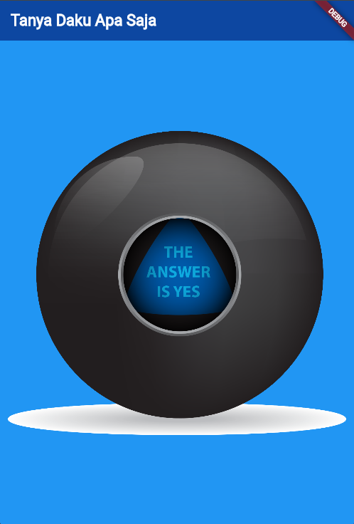

# 🎱 Tanya Daku PBM

Proyek **Tanya Daku PBM** adalah sebuah aplikasi Flutter interaktif bergaya **Magic 8-Ball**. Pengguna bisa bertanya apa saja, lalu mengetuk bola untuk melihat jawaban acak seperti:
- ✅ Yes
- ❌ No
- 🤷‍♂️ I have no idea
- 🤷‍♂️ Ask Again Later
---

## 📱 Fitur Utama
- Tampilan UI sederhana dan intuitif.
- Menekan bola untuk men-generate jawaban secara acak.
- Jawaban diambil dari gambar `ball1.png` hingga `ball5.png` di dalam folder `images`.
- Mudah diubah dan dikembangkan sesuai kebutuhan.

---

## 🖼️ Screenshot 

---

## 🧭 Cara Kerja
1. Ketika pengguna mengetuk bola (`TextButton`), `setState()` dipanggil untuk memperbarui angka acak.
2. Angka acak menentukan gambar bola (misalnya `images/ball1.png`, `images/ball2.png`, dst.).
3. Masing-masing gambar merepresentasikan jawaban:
   - `ball1.png` → Yes
   - `ball2.png` → No
   - `ball3.png` → I have no idea
   - dan seterusnya sesuai kebutuhanmu.

---
